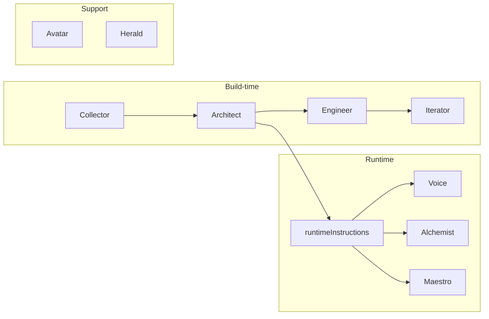

# Cardzzz Master Prompt v3.0 implementation plan

## Scope and constraints

- **No major flow or UX changes**: Same routes, same Collector → Architect → Engineer → Iterator pipeline; same editor and export flow.
- **Prompt and schema only for build-time agents**: Rewrite system/user prompts; add one new Blueprint field for runtime instructions.
- **Runtime agents**: Add five new agent modules (Avatar, Voice, Alchemist, Maestro, Herald) with prompts and a minimal API so you can test inputs/outputs.
- **Sentence case**: All new prose (identity engine, prompts) in sentence case. No title case in prose.
- **Emoji**: Identity engine defines max one emoji per message and approved/banned lists; only Collector and Iterator reference it.

---

## Critical findings and decisions

1. **Architect must output the "Will" for runtime agents**
  The master requires the Architect to generate **system instructions for agents 6, 7, 8** (Voice, Alchemist, Maestro) so the receiver cannot override character. The current [Blueprint](src/lib/types.ts) has no such field. We will add `runtimeInstructions?: { text?: string; image?: string; music?: string }` to the Blueprint type and to the Architect’s JSON schema and normalization so it is stored with the card and passed to runtime agents.
2. **Iterator is a full LLM (Google Gemini)**
  The Iterator will **use an LLM** (Gemini via existing [src/lib/llm.ts](src/lib/llm.ts)) with a proper **system instruction** and **user prompt**, so you can iterate on prompts and get the most out of the product. It will use the **identity engine** for tone (Digital Confidant, Effortless Authority, "Materialize"). Implementation: replace hardcoded [getIteratorReply](src/lib/agents/iterator.ts) with an async call that builds messages (editor history + latest user message), injects identity summary into the system instruction, and returns the model reply. Special cases (e.g. "pop" for paywall, or when to show export UI) remain in code; the LLM handles the conversational reply. This makes the Iterator the main place to tune identity-driven copy.
3. **Identity engine only for Collector and Iterator**
  The identity engine is **only** used for **Agent 1 (Collector)** and **Agent 4 (Iterator)** for tone. **No other agents** reference it:
  - **Architect (2)** and **Engineer (3)**: tone does not matter (JSON/code output); do not reference the identity engine.
  - **All runtime agents (5–9)**: completely **agnostic** of the identity engine. Their tone is determined by **sender and receiver input** and how the sender has shaped them (e.g. via Architect’s runtimeInstructions). They must take on the personality the sender wants, not a fixed brand voice. Herald (9) is also agnostic: no Digital Confidant tone in system instruction; teaser can be neutral or sender-shaped.
4. **Runtime agents are new modules**
  There are no existing runtime agents in [src/lib/agents](src/lib/agents). We will add: `avatar.ts`, `voice.ts`, `alchemist.ts`, `maestro.ts`, `herald.ts`. Each will expose a function that takes the necessary context (e.g. blueprint, receiver input) and returns the agent output. Avatar and Alchemist output **prompts** for **German Eye** and **Nano Banana** (image generation). Maestro outputs **tags/prompt for Suno** (music generation for now). Voice outputs **final text**; Herald outputs a **one-sentence teaser** (agnostic tone).
5. **Runtime agents: no hardcoded match to website background**
  Senders should be able to set up runtime agents however they want. **Do not** require that runtime agent output (music style, image style, etc.) must match or correlate with the website background colour. Theme/colour may be used as **initial concepts or inspiration** in prompts, but must not be hardcoded as a strict requirement (e.g. remove "must match primaryBackground vibe" from Maestro; keep runtime agents flexible and sender-driven).
6. **Image stack: German Eye and Nano Banana**
  Use **German Eye** and **Nano Banana** for image generation for both **Avatar (Agent 5)** and **Alchemist (Agent 7)**. Agents produce prompts (or structured requests) suitable for these services; actual API integration can be added when endpoints are available.
7. **Music stack: Suno**
  Use **Suno** for music generation for now. Maestro (Agent 8) outputs genre, mood, and BPM-style tags (or a prompt) formatted for Suno.
8. **Testing runtime agents**
  The card currently POSTs to [webhook-proxy](src/app/api/webhook-proxy/route.ts), which forwards to `WEBHOOK_URL`. To test the new agents without changing the card yet, we will add a **POST /api/card/action** (or a dedicated test route) that: accepts `token` (or cardId), `buttonType` (text | music | image), and `receiverInput`; loads the card’s blueprint; calls the corresponding agent (Voice, Alchemist, or Maestro); returns the result. Optional: a test route that accepts a mock blueprint in the body for quick checks without a real card.

---

## Phase 1: Identity Engine (single file)

**Task:** Create the brand identity file so all agent prompts can reference it.

- **Path:** [.cursor/rules/brand/identity-engine.md](.cursor/rules/brand/identity-engine.md) (new; create directory `brand` under `.cursor/rules`).
- **Content:** Populate with the exact structure from the master:
  - **1. The Persona: The Digital Confidant** (high-taste, observant, cool, witty).
  - **A. Core Communication Pillars**: Selective Sophistication (curate, materialize, signal, etc.; avoid optimize, synergy, features); Mirror & Elevate; Effortless Authority (never ask permission; offer a vision) with bad/good examples.
  - **B. The Emoji Protocol**: max one emoji per message; **Approved List** (🔮 ✨ 🪶 🎞️ 📂 ☁️ ⏳ 🕯️ 🥀 🎧 🖼️ 🗝️ 🐚 🕰️); **Banned List** (🤖 🚀 📈 💖 🌟 👍 ✅ 😂 🤣 🔥).
  - **C. Hard Constraints & Grammar**: No AI apologies; no title case in prose; no M-dashes; no generic gratitude ("Thank you for using Cardzzz"); use "Run that back" / "Let’s get this link out" / "The dream is ready" style.
- **Formatting:** All prose in sentence case. No content summarised or dropped.

**Identity loader (recommended):** Add a small util that reads this file and returns a **short summary** (e.g. 3–5 lines) for injection into **Collector and Iterator only**: e.g. `src/lib/brand/identity.ts` with `getIdentityEngineSummary(): Promise<string>`. Use `fs`/`path` and the project root so the summary can be inlined into their system prompts. No other agents reference the identity engine.

---

## Phase 2: Schema change (Blueprint runtime instructions)

**Task:** Extend the Blueprint so the Architect can store the "Will" for runtime agents.

- **File:** [src/lib/types.ts](src/lib/types.ts).
- **Change:** Add to `Blueprint`:
  - `runtimeInstructions?: { text?: string; image?: string; music?: string }`.
- **Semantics:** When present, `runtimeInstructions.text` is the system instruction for the Voice (text) agent; `runtimeInstructions.image` for the Alchemist; `runtimeInstructions.music` for the Maestro. All are optional so existing builds and fallbacks remain valid.

---

## Phase 3: Build-time agent prompt updates

### 3.1 Collector (Agent 1)

- **File:** [src/lib/agents/collector.ts](src/lib/agents/collector.ts).
- **Updates:**
  - **COLLECTOR_SYSTEM**: Replace with Digital Confidant persona. Goal: 1–2 exchanges; extract Recipient, Vibe, Central Subject. Instruct: observe and mirror the user’s tone; ask who this is for, what’s the vibe, what is the center of the world (Avatar vs Object); stop once you have enough for a creative summary. Prepend (or reference) a 2–3 line identity summary: no AI apologies, no title case, max one emoji from approved list, Effortless Authority.
  - **COMPLETION_CHECK_PROMPT**: Keep the same logic (enough for first draft / JSON). Optionally add a one-line system instruction for the completion-check call: "You are a completion checker. Respond with JSON only." to improve JSON reliability.
  - **TRANSLATE_PROMPT** and translate **systemInstruction**: Keep "output only valid JSON" and the CreativeSummary keys; ensure wording is consistent with "creative summary" and sentence case. No change to the JSON shape (recipientName, senderName, senderVibe, centralSubject, centralSubjectStyle, tone, productConfirmed, notes).

### 3.2 Architect (Agent 2)

- **File:** [src/lib/agents/architect.ts](src/lib/agents/architect.ts).
- **Updates:**
  - **ARCHITECT_PROMPT**: Expand to require:
    - Same blueprint keys as today (heading, description, statusBar, centralImage, buttons, primaryBackground, secondaryBackground, textColor, themeName).
    - **New:** `runtimeInstructions` object with three optional keys: `text`, `image`, `music`. Describe: "For each button type (text, image, music) provide a 'Will'—a system instruction that the runtime agent must follow so the receiver cannot override the sender’s character or theme. These are Task Envelopes: immutable rules for the 48-hour runtime."
  - **System instruction**: "You are a master design architect. You turn vibes into hex codes and interaction logic. Assign themeName, primaryBackground, secondaryBackground, textColor. Define runtimeInstructions for the text, image, and music agents so they never break character. Output only valid JSON."
  - **ArchitectJson type** (local to file): Add `runtimeInstructions?: { text?: string; image?: string; music?: string }`.
  - **creativeSummaryToBlueprint**: Parse `out.runtimeInstructions` and assign to the returned Blueprint; if missing or malformed, use `{}` so downstream can fall back to defaults.

### 3.3 Engineer (Agent 3)

- **File:** [src/lib/agents/engineer.ts](src/lib/agents/engineer.ts).
- **Updates:**
  - **ENGINEER_SYSTEM**: Specify React 19, Tailwind (CDN), Framer Motion; "fever dream" entrance animations (dreamlike, subtle); glassmorphism for overlays/modals where appropriate; output ONLY raw code, no markdown or code fences; camelCase for JSX/SVG; `{/* */}` comments only.
  - **ENGINEER_PROMPT**: Same requirements as today (single App.tsx, 1–4 buttons, webhook-proxy for submit/notify, React 19, framer-motion, lucide-react). Add one line: use Framer Motion for entrance animations that feel dreamlike, and glassmorphism for modal/overlay styling. No change to postProcessCode or stripCodeFences logic.

### 3.4 Iterator (Agent 4) — full LLM (Google Gemini)

- **File:** [src/lib/agents/iterator.ts](src/lib/agents/iterator.ts).
- **Change:** Transition the Iterator to an **LLM** (Gemini via existing [src/lib/llm.ts](src/lib/llm.ts)) so you can iterate on system and user prompts and get the most out of the product. The Iterator has an important role in helping the user refine the card; it will use the **identity engine** for tone.
- **Implementation:**
  - **getIteratorReply** becomes **async**: it accepts editor message history (or recent messages) + latest user text, and calls `generate()` with:
    - **System instruction:** Identity engine summary (pillars, emoji rule, hard constraints) + Iterator-specific instruction: Effortless Authority; don’t just do the change, elevate it; use the brand voice; when the user is satisfied, prompt them to "Materialize" (export). No AI apologies, no title case, max one emoji from approved list.
    - **User prompt / messages:** Conversation context (recent editor messages) + latest user message. Optionally include a short summary of the current card state (heading, theme) so the LLM can suggest concrete tweaks.
  - **Special cases** stay in code before calling the LLM: e.g. if user says "pop" → return empty (paywall trigger); if the LLM response or user intent indicates "export" → return a message with `type: "export"` so the UI shows the export CTA. The editor API route ([src/app/api/editor/send/route.ts](src/app/api/editor/send/route.ts)) must await the new async `getIteratorReply` and pass message history if available.
  - **applyIteration** logic is unchanged (keyword-based blueprint tweaks + Engineer + Watcher). Only the **reply** is now LLM-generated.
  - **Message history:** The Iterator LLM needs recent editor messages (e.g. last N turns). Either the client sends them in the request body (e.g. `recentMessages`) or the API loads them from session/build if we persist editor chat; implement the minimal path (e.g. client sends last 5–10 messages) so the LLM has context.
- **Deliverables:** Clear, documented **ITERATOR_SYSTEM** and **ITERATOR_USER** (or message-building) constants so you can tune prompts easily. Identity engine is the only tone source for this agent.

---

## Phase 4: Runtime agents (new modules)

All new files under `src/lib/agents/`. Each module exports a single main function that takes typed inputs and returns the agent output (string or structured). Use the existing [src/lib/llm.ts](src/lib/llm.ts) `generate` / `generateJson` where an LLM call is needed.

### 4.1 Avatar (Agent 5)

- **File:** `src/lib/agents/avatar.ts`.
- **Purpose:** Generate a **prompt** for a high-aesthetic avatar from the blueprint vibe and optional uploaded photo reference. Output is used with **German Eye** and **Nano Banana** for image generation. **Tone-agnostic:** no identity engine; personality comes from sender/blueprint.
- **System instruction (suggested):** "Take the uploaded photo and the blueprint vibe. Generate a prompt for a high-aesthetic avatar that retains the subject's likeness but matches the card’s mini-verse (e.g., Cyberpunk, Oil Painting, Lo-Fi). Output only the prompt, no commentary. Do not require the result to match the website background colour; the sender defines the aesthetic."
- **Inputs:** Blueprint (themeName, centralSubjectStyle, tone, centralImage description) and optionally an image reference (URL or description). Output format should be suitable for German Eye and Nano Banana when integrated.
- **Output:** Single string (the avatar prompt for German Eye / Nano Banana).
- **Function signature:** `export async function generateAvatarPrompt(blueprint: Blueprint, imageRef?: string): Promise<string>`.

### 4.2 Voice (Agent 6)

- **File:** `src/lib/agents/voice.ts`.
- **Purpose:** Character-locked text for the receiver; Task Envelope = [Architect’s Will] + [Receiver Input]. **Tone-agnostic:** no identity engine; personality comes entirely from the sender via `runtimeInstructions.text`.
- **System instruction:** Use `blueprint.runtimeInstructions?.text` as the **system instruction** (the "Will"). If missing, use a fallback: "You are the card’s voice. Stay in character. Respond to the receiver’s topic without breaking persona."
- **User prompt (template):** "TASK: Respond in character. TOPIC: [RECEIVER_INPUT]. Remain in character as defined in the system instructions."
- **Inputs:** Blueprint (for runtimeInstructions.text), receiverInput string.
- **Output:** Generated text (the reply the receiver sees).
- **Function:** `export async function runVoice(blueprint: Blueprint, receiverInput: string): Promise<string>`.

### 4.3 Alchemist (Agent 7)

- **File:** `src/lib/agents/alchemist.ts`.
- **Purpose:** Convert receiver input into an image prompt for **German Eye** and **Nano Banana** (image manipulation/generation). Follow the card’s theme and sender’s runtime instructions; **tone-agnostic** (no identity engine). Do not require output to match the website background; sender defines the aesthetic.
- **System instruction:** Use `blueprint.runtimeInstructions?.image` as the "Will" when present; else fallback: "Convert receiver input into an image prompt. Follow the card’s themeName and aesthetic. Output only the prompt. Do not require the result to match or correlate with the website background colour."
- **User prompt:** Combine themeName + runtimeInstructions.image (if any) + receiverInput into a task envelope; e.g. "SCENE: [receiverInput]. Style: [themeName]. [runtimeInstructions.image]."
- **Output:** Single string (the image prompt for German Eye / Nano Banana).
- **Function:** `export async function runAlchemist(blueprint: Blueprint, receiverInput: string): Promise<string>`.

### 4.4 Maestro (Agent 8)

- **File:** `src/lib/agents/maestro.ts`.
- **Purpose:** Output genre, mood, and BPM-style tags (or prompt) for **Suno** (music generation for now). **Tone-agnostic:** no identity engine; sender defines style via runtimeInstructions. Do **not** hardcode that music must match or correlate with the website background colour; theme/colour may inform initial concepts but the sender sets up the agent how they want.
- **System instruction:** Use `blueprint.runtimeInstructions?.music` as the "Will" when present; else fallback: "Output only genre, mood, and BPM tags for Suno. No prose. Do not require the music to match the website background; the sender’s instructions define the style."
- **User prompt:** Combine runtimeInstructions.music + receiver’s description; e.g. "GENERATE_STYLE_TAGS: Combine with established genre. HUMAN_DESCRIPTION: [receiverInput]."
- **Output:** Comma-separated tags or a small structured object suitable for Suno API.
- **Function:** `export async function runMaestro(blueprint: Blueprint, receiverInput: string): Promise<string>` (or return `{ tags: string }`).

### 4.5 Herald (Agent 9)

- **File:** `src/lib/agents/herald.ts`.
- **Purpose:** One-sentence teaser for WhatsApp/Email delivery. **Tone-agnostic:** do not use the identity engine; the teaser should be neutral or shaped by sender/card context (e.g. heading, theme), not a fixed brand voice. No clickbait; intrigue only.
- **System instruction:** "Write a 1-sentence teaser for the receiver. No clickbait. Only intrigue. Tone can reflect the card’s theme or stay neutral; do not use a fixed brand persona."
- **Inputs:** Card context (e.g. heading, themeName, buttonLabel) and optional receiver action.
- **Output:** Single string (the teaser).
- **Function:** `export async function runHerald(context: { heading?: string; themeName?: string; buttonLabel?: string }): Promise<string>`.

---

## Phase 5: Wire Architect output into runtime

- **Architect** already updated in Phase 3 to produce and normalize `runtimeInstructions`.
- **Storage:** Blueprint (with `runtimeInstructions`) is already stored on Build and passed to the Engineer; when a card is exported, the same blueprint is available for the card’s runtime. Ensure [store](src/lib/store.ts) and any card fetch return the blueprint so `/api/card/action` can read it.
- **Fallbacks:** Voice, Alchemist, Maestro must handle missing `runtimeInstructions.text` / `.image` / `.music` with safe defaults (as in 4.2–4.4) so old cards still work.

---

## Phase 6: Testable API for runtime agents

**Task:** Allow calling runtime agents so you can test inputs and outputs.

- **New route:** `POST /api/card/action` (or `POST /api/agents/run` for a test-only surface).
  - **Body:** `{ token: string, buttonType: "text" | "music" | "image", receiverInput: string }`. For a test-only route: `{ agent: "voice" | "alchemist" | "maestro" | "avatar" | "herald", payload: { ... } }`.
  - **Logic:** Resolve card by token (or by cardId); load blueprint; if buttonType is text → run Voice, music → Maestro, image → Alchemist; return `{ success, output }`. Optional: add a separate test route that accepts a mock blueprint in the body so you can test without a real card.
- **Auth / security:** Card action should validate that the card is active and (if applicable) that the request is from the receiver; for an internal test route, restrict by env or omit in dev. Detail can be decided in implementation.
- **Exports:** Update [src/lib/agents/index.ts](src/lib/agents/index.ts) to export the new agent functions (avatar, voice, alchemist, maestro, herald) so the API and any scripts can call them.

---

## Phase 7: Identity loader (Collector and Iterator only)

- **File:** `src/lib/brand/identity.ts` (or `src/lib/agents/identity.ts`).
- **Function:** `getIdentityEngineSummary(): Promise<string>` reads `.cursor/rules/brand/identity-engine.md` and returns either the full content or a 3–5 line summary (pillars + emoji rule + hard constraints) for injection into **Collector and Iterator system prompts only**. No other agents reference the identity engine. Use `path.join(process.cwd(), ".cursor", "rules", "brand", "identity-engine.md")` so it works in Next API routes. If the file is missing, return a short fallback string so agents don’t break.

---

## Implementation order (recommended)

1. Create [.cursor/rules/brand/identity-engine.md](.cursor/rules/brand/identity-engine.md) with full content.
2. Update [src/lib/types.ts](src/lib/types.ts) (Blueprint.runtimeInstructions).
3. Update Collector, Architect, Engineer, Iterator prompts in place (Phases 3.1–3.4).
4. Add runtime agent modules: avatar, voice, alchemist, maestro, herald (Phase 4).
5. Add identity loader and wire summary into Collector and Iterator system prompts only (Phase 7).
6. Add POST /api/card/action (or test route) and wire to Voice/Alchemist/Maestro (Phase 6).
7. Export new agents from [src/lib/agents/index.ts](src/lib/agents/index.ts).

---

## What we are not changing (minimal scope)

- No change to chat or editor **flows** (approve, sign-in, export, share).
- No change to **webhook-proxy** behavior; optional later: have the proxy call our runtime agents when `WEBHOOK_URL` is unset.
- No **image/music external API** calls inside the repo for Phase 1; agents output prompts/tags for German Eye, Nano Banana, and Suno; integration can be added when endpoints are ready.
- No **activation timestamp** or other receiver-flow changes.

---

## Risk and validation

- **Architect JSON shape:** Adding `runtimeInstructions` may cause the LLM to occasionally omit or malform it. Normalize with fallbacks (`out.runtimeInstructions ?? {}`) and optional chaining in runtime agents.
- **Identity file path:** In Vercel or serverless, `process.cwd()` may differ; ensure the path to `.cursor/rules/brand/identity-engine.md` is resolved relative to the project root (e.g. `process.cwd()` in Next API routes usually is the project root).
- **Testing:** After implementation, run a build (Collector → approve → Architect → Engineer), then call POST /api/card/action with the new card’s token and each buttonType to confirm Voice, Alchemist, and Maestro outputs.

---

## Summary diagram

- Only Collector and Iterator use the identity engine for tone; Architect and Engineer do not; runtime agents (Avatar, Voice, Alchemist, Maestro, Herald) are tone-agnostic and sender-driven.
- Architect writes `runtimeInstructions` into the Blueprint; Voice, Alchemist, Maestro read them at runtime.
- Iterator is a full LLM (Gemini) with identity-aligned system/user prompts. Avatar and Alchemist output prompts for German Eye and Nano Banana; Maestro outputs for Suno.

