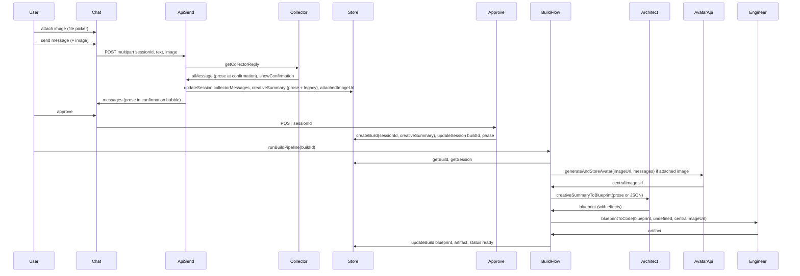

# Prose-first, image pipeline, and high-end effects (Route B)

## Current state (brief)

- **Collector** ([src/lib/agents/collector.ts](src/lib/agents/collector.ts)): Uses completion check and `extractCreativeSummary` to produce a **JSON** `CreativeSummary`; the approval message shown in the UI is the raw LLM reply text, not a dedicated prose summary. Stored in `session.creativeSummary` (JSONB).
- **Chat send** ([src/app/api/chat/send/route.ts](src/app/api/chat/send/route.ts)): Accepts only `sessionId` and `text` ([ChatSendBody](src/lib/types.ts)); no image. On `showConfirmation`, calls `extractCreativeSummary` and stores the JSON summary.
- **Attach in Chat** ([src/components/Chat.tsx](src/components/Chat.tsx), [src/hooks/useChatLogic.ts](src/hooks/useChatLogic.ts)): `Comp_Attach` only toggles `hasAttachedFile`; no file picker or file sent.
- **Architect** ([src/lib/agents/architect.ts](src/lib/agents/architect.ts)): `creativeSummaryToBlueprint(summary)` takes a `CreativeSummary` object and passes `JSON.stringify(summary)` to the LLM. No `effects` on the blueprint.
- **Build flow** ([src/lib/build-flow.ts](src/lib/build-flow.ts)): `runBuildPipeline(buildId)` runs `creativeSummaryToBlueprint(build.creativeSummary)` then `blueprintToCode(blueprint)`. No image URL or avatar step.
- **Engineer** ([src/lib/agents/engineer.ts](src/lib/agents/engineer.ts)): Receives only `Blueprint`; no `centralImageUrl`; no `effects`; prompt does not mandate a circular frame or placeholder.
- **Types** ([src/lib/types.ts](src/lib/types.ts)): `CreativeSummary` is a fixed JSON shape; `Blueprint` has no `effects`. Sessions and builds use `creative_summary: Json` in the DB.

---

## 1. Prose-first creative summary

**Goal:** Sender sees only a short paragraph (2–4 sentences) at approval; that same prose is the sole input to the Architect. No JSON or effect names in the approval message.

**1.1 Extend CreativeSummary and storage**

- In [src/lib/types.ts](src/lib/types.ts): Add optional `prose?: string` to `CreativeSummary`. When present, it is the canonical input for the Architect. Keep existing fields for backward compatibility (fallback when `prose` is absent).
- No DB migration required: `creative_summary` is already `Json`; store `{ prose: string, ... }` or legacy shape.

**1.2 Collector: generate and show prose at confirmation**

- In [src/lib/agents/collector.ts](src/lib/agents/collector.ts):
  - When completion check passes (`showConfirmation === true`), instead of (or in addition to) returning the raw chat reply as the confirmation message, **generate a short prose summary** (2–4 sentences) from the conversation. Options: (A) Add an LLM call that takes the transcript and returns only that paragraph (no JSON), or (B) Have the main reply prompt ask for that paragraph when “presenting for approval” and use that as the confirmation message.
  - The **approval bubble** in [Chat.tsx](src/components/Chat.tsx) already displays `message.text`; so the AI message returned when `type === "confirmation"` must have `text` set to this prose paragraph.
  - After generating prose, call or reuse logic to also produce legacy `CreativeSummary` (for fallback and for any consumers that still need structured fields). Store on session an object that includes **both** `prose` and the legacy fields (e.g. `recipientName`, `senderName`, etc.) so that Architect can use `prose` when present and build/createBuild continue to receive a valid `CreativeSummary`.
- In [src/app/api/chat/send/route.ts](src/app/api/chat/send/route.ts): When `showConfirmation` is true, persist `creativeSummary` that includes `prose` (and legacy fields). Ensure the last AI message in the response is the prose (so the confirmation bubble shows it).

**1.3 Architect: consume prose when present**

- In [src/lib/agents/architect.ts](src/lib/agents/architect.ts): Change `creativeSummaryToBlueprint(summary)` so that:
  - If `summary.prose` is present, pass **only the prose string** to the LLM (e.g. prompt: “Turn this creative summary into a fixed card blueprint. Creative summary: [prose]. Output ONLY valid JSON with keys: …” including the new `effects` block).
  - If `summary.prose` is absent, keep current behavior: pass `JSON.stringify(summary, null, 2)` so existing sessions/builds still work.

---

## 2. Image in Collector and first build

**Goal:** Attach = image-only file picker; image is sent, stored, and (when approved) run through Gemini/Nano Banana with “Create an avatar” + task envelope from conversation; result is stored and passed to the Engineer as the central image URL. Engineer always uses a circular frame; placeholder when no URL.

**2.1 Attach: file picker and send**

- In [src/components/Chat.tsx](src/components/Chat.tsx): Replace the attach button’s toggle-only behavior with an **image-only file input** (e.g. `accept="image/*"`). On file select, keep a ref or state to the selected `File` (and optionally show a thumbnail or “1 image attached”). Only in Collector mode.
- In [src/hooks/useChatLogic.ts](src/hooks/useChatLogic.ts): For collector mode, when sending, if an image file is attached, send via **multipart/form-data** to `/api/chat/send` (e.g. `sessionId`, `text`, `image`: File) or use a two-step: upload image first to a new endpoint (e.g. `POST /api/chat/upload-image`) that returns an image URL or storage key, then send that key with the message. Plan should pick one (multipart is simpler in one call).
- Extend [ChatSendBody](src/lib/types.ts) or the API contract: either `FormData` with `sessionId`, `text`, `image`, or JSON with `sessionId`, `text`, `imageUrl`/`imageKey` after upload.

**2.2 API: receive and store image on session**

- [src/app/api/chat/send/route.ts](src/app/api/chat/send/route.ts): Accept multipart (or JSON with image URL if upload-first). If an image is present, store it (e.g. to blob storage or base64 in DB; prefer a stable URL for the Engineer). Persist the **image URL or storage key on the session** (e.g. `session.collectorAttachedImageUrl` or equivalent). Session type in [src/lib/types.ts](src/lib/types.ts) and store in [src/lib/store.ts](src/lib/store.ts) must support this; DB has no column for it today—either add a column (e.g. `attached_image_url` or `collector_attached_image_url`) or store a JSON blob that includes it in an existing JSON column. Recommend adding a nullable column or extending the session row mapping so the build pipeline can read “session’s attached image URL” at build start.

**2.3 Avatar API route (Nano Banana)**

- New route (e.g. `POST /api/avatar/generate` or internal-only function called from build flow): **Inputs:** stored image URL (or buffer) + conversation context (e.g. `session.collectorMessages` or the prose/summary). **Logic:** (1) Extract style/intent from the conversation (e.g. LLM call: “From this conversation, extract a 1–2 sentence description of how the sender wants the avatar to look or feel.”). (2) Call Gemini (Nano Banana): system instruction “Create an avatar.”; user prompt “Create an avatar based on [extracted description].”; send the uploaded image + these prompts (image + text → image). (3) Receive the returned image; store it (blob store or base64); obtain a stable URL. (4) Return that URL. This can be an internal function `generateAndStoreAvatar(imageUrl, conversationContext): Promise<string>` used by the build pipeline rather than a public POST if preferred.

**2.4 Build pipeline: central image URL for Engineer**

- In [src/lib/build-flow.ts](src/lib/build-flow.ts): Before or after `creativeSummaryToBlueprint`, if the session has an attached image URL, call the avatar pipeline (e.g. `generateAndStoreAvatar(session.collectorAttachedImageUrl, session.collectorMessages)`). Obtain `centralImageUrl`. If no attached image, set `centralImageUrl` to a **placeholder URL** (e.g. a static asset path like `/placeholder-avatar.svg` or a known CDN placeholder).
- Pass `centralImageUrl` into the Engineer: extend `blueprintToCode(blueprint, previousCode?, centralImageUrl?: string)` (or add it to a small context object). Engineer prompt and code generation must receive this and render the central subject in a **circular frame** using `centralImageUrl` when provided, otherwise the placeholder.

**2.5 Engineer: circular frame and central image**

- In [src/lib/agents/engineer.ts](src/lib/agents/engineer.ts): Update `ENGINEER_PROMPT` and optionally `ENGINEER_SYSTEM` to require: (1) The central visual is always inside a **circular frame**. (2) Use the provided `centralImageUrl` (or placeholder URL) as the `src` for that element; no external image URLs except the one provided. (3) If no URL is provided, use the placeholder. Signature: `blueprintToCode(blueprint: Blueprint, previousCode?: string, centralImageUrl?: string)`.

---

## 3. High-end effects — Route B (structured schema)

**Goal:** Blueprint includes an `effects` object with an extensive taxonomy. Architect (given only prose) chooses from a large set of options per dimension; “none” is always allowed. Engineer implements each chosen effect explicitly.

**3.1 Effects taxonomy (full)**

Define in [src/lib/types.ts](src/lib/types.ts) (and document in a single source of truth, e.g. a comment block or `docs/BLUEPRINT_EFFECTS.md`) the following. Every key must support a literal `"none"` (or equivalent) option.

- **buttonStyle:** `"none"` | `"solid"` | `"gradient"` | `"outline"` | `"glass"` | `"softGlow"` | `"bordered"` | `"minimal"` | `"pill"` | `"neon"`
- **frameBackdrop:** `"none"` | `"glow"` | `"pulse"` | `"softGlow"` | `"particles"` | `"gradientRing"` | `"shimmer"` | `"halo"` | `"subtleShadow"`
- **entranceEffect:** `"none"` | `"confetti"` | `"particles"` | `"fade"` | `"scaleIn"` | `"subtleDrift"` | `"blurIn"` | `"stagger"` | `"floatUp"`
- **cardContainer:** `"none"` | `"glass"` | `"softBorder"` | `"elevated"` | `"minimal"` | `"gradientBorder"`
- **typographyTreatment:** `"none"` | `"subtleShadow"` | `"gradientText"` | `"letterSpacing"` | `"allCaps"` | `"serif"` | `"rounded"`

**3.2 Types**

- In [src/lib/types.ts](src/lib/types.ts): Add `BlueprintEffects` type with the above keys and union types. Add `effects?: BlueprintEffects` to `Blueprint`. Default for legacy blueprints: when `effects` is absent, treat as all `"none"` (or a minimal default object with each key `"none"`).

**3.3 Architect prompt**

- In [src/lib/agents/architect.ts](src/lib/agents/architect.ts): Update the prompt so that:
  - Input is either prose only (when `summary.prose` exists) or the JSON summary string.
  - Output schema includes the **effects** object with every key and the full list of allowed values. Instruct the Architect that outputs must feel **high-end and polished**; it has full creative freedom to pick any option or `"none"` per dimension. Include the full taxonomy in the prompt (or a reference to it) so the LLM only outputs allowed values.

**3.4 Engineer prompt**

- In [src/lib/agents/engineer.ts](src/lib/agents/engineer.ts): Update the prompt so that:
  - The blueprint JSON includes `effects`. For each key in `effects`, if the value is not `"none"`, implement the corresponding visual/animation (e.g. gradient buttons, pulsating frame glow, confetti on first mount). If the value is `"none"`, omit that effect. List the concrete implementation hints (e.g. “buttonStyle gradient: use a CSS gradient on the button background”; “entranceEffect confetti: use a light confetti animation on first load”) so the generated code is consistent. Ensure the Engineer reads `blueprint.effects` and implements only the allowed enum values.

**3.5 Backward compatibility**

- When normalizing Architect output or in `creativeSummaryToBlueprint`, if the LLM omits `effects`, set `effects` to an object with all keys `"none"`. When the Engineer receives a blueprint without `effects`, treat as all `"none"` so existing builds and realign flows still work.

---

## 4. Data flow summary

---

## 5. Deliverables checklist

- **Types:** `CreativeSummary.prose`; `Session` with attached image reference (e.g. `collectorAttachedImageUrl?`); `Blueprint.effects` with full taxonomy; `BlueprintEffects` type.
- **Collector:** Prose generation at confirmation; approval message = prose only; store prose + legacy on session; no effect names in prose.
- **Chat + useChatLogic:** Attach = image-only file picker; send image with message (multipart or upload-then-send); API accepts and stores image on session.
- **API:** Chat send handles image and stores URL/key on session; new avatar route or internal `generateAndStoreAvatar` (image + conversation → Gemini/Nano Banana → store → return URL).
- **Build flow:** After approve, if session has attached image, run avatar pipeline and get `centralImageUrl`; else use placeholder; call `blueprintToCode(blueprint, prev, centralImageUrl)`.
- **Architect:** Accept prose when present; output Blueprint including `effects` with full taxonomy; high-end, creative freedom, none allowed.
- **Engineer:** Accept optional `centralImageUrl`; always circular frame + placeholder or URL; implement `blueprint.effects` per taxonomy; handle `none`.
- **Docs:** Single source of truth for effects taxonomy (e.g. in types or `docs/BLUEPRINT_EFFECTS.md`).
- **Backward compatibility:** Legacy creative summary (no prose) still works; blueprints without `effects` default to all `none`. No new user-facing flows; follow .cursor/rules.
- **Editor mobile preview:** `Comp_editor_container` frames preview with 10px padding; Sandpack preview-only, no “open in sandbox”; preview displayed as mobile and fills the frame; interactive.

---

## 6. Files to touch (summary)

| Area           | Files                                                                                                                                                                                                                                                                                   |
| -------------- | --------------------------------------------------------------------------------------------------------------------------------------------------------------------------------------------------------------------------------------------------------------------------------------- |
| Types          | [src/lib/types.ts](src/lib/types.ts) (CreativeSummary.prose, Session attached image, Blueprint.effects, BlueprintEffects)                                                                                                                                                               |
| Collector      | [src/lib/agents/collector.ts](src/lib/agents/collector.ts) (prose at confirmation, store prose + legacy)                                                                                                                                                                                |
| Chat send      | [src/app/api/chat/send/route.ts](src/app/api/chat/send/route.ts) (multipart/image, store image ref on session)                                                                                                                                                                          |
| Store / DB     | [src/lib/store.ts](src/lib/store.ts), [src/lib/database.types.ts](src/lib/database.types.ts) if adding session column for attached image                                                                                                                                                |
| Avatar         | New [src/app/api/avatar/generate/route.ts](src/app/api/avatar/generate/route.ts) or [src/lib/avatar-pipeline.ts](src/lib/avatar-pipeline.ts) (image + context → Gemini → store → URL)                                                                                                   |
| Build flow     | [src/lib/build-flow.ts](src/lib/build-flow.ts) (avatar pipeline when image attached, centralImageUrl to Engineer)                                                                                                                                                                       |
| Architect      | [src/lib/agents/architect.ts](src/lib/agents/architect.ts) (prose input, effects output, taxonomy in prompt)                                                                                                                                                                            |
| Engineer       | [src/lib/agents/engineer.ts](src/lib/agents/engineer.ts) (centralImageUrl, circular frame, effects implementation)                                                                                                                                                                      |
| Front-end      | [src/components/Chat.tsx](src/components/Chat.tsx) (image file input), [src/hooks/useChatLogic.ts](src/hooks/useChatLogic.ts) (send with image)                                                                                                                                         |
| Editor preview | [src/components/EditorChat.tsx](src/components/EditorChat.tsx) (Comp_editor_container: 10px padding, frame mobile preview), [src/components/PreviewWrapper.tsx](src/components/PreviewWrapper.tsx) (Sandpack layout preview, showOpenInCodeSandbox false, mobile viewport, interactive) |

No placeholders or TODOs in production paths; error handling and validation per NFRs.

---

## 7. Editor mobile preview (Comp_editor_container)

**Goal:** The editor’s preview area is a proper mobile phone frame: 10px padding around the preview, preview rendered as mobile (not desktop), no “open in sandbox” UI, and the preview is interactive (user can see the card and click buttons).

**Current state**

- [EditorChat.tsx](src/components/EditorChat.tsx): `Comp_editor_container` has `p-[10px]` and wraps an inner div `w-[390px] max-w-full h-[720px]` that contains `PreviewWrapper`. So the outer frame already has 10px padding; the issue is the **preview content** (Sandpack) renders at desktop size and may not fit or may show Sandpack chrome (e.g. “open in CodeSandbox”).
- [PreviewWrapper.tsx](src/components/PreviewWrapper.tsx): Uses `@codesandbox/sandpack-react` with `editorWidthPercentage: 0` (no editor), but does not set `layout: "preview"` or `showOpenInCodeSandbox: false`. The preview iframe is not constrained to a mobile viewport, so the card app likely renders full-width like a desktop page.

**7.1 Comp_editor_container layout**

- In [EditorChat.tsx](src/components/EditorChat.tsx): Ensure the structure is exactly: outer `Comp_editor_container` with `p-[10px]` on all sides; single child = mobile preview “phone” (390×720) that **fills** the remaining space inside the padding. So the phone frame is `(container width - 20px) × (container height - 20px)` or fixed 390×720 with no overflow. The preview content (Sandpack) must live entirely inside this inner frame and fill it so nothing desktop-sized spills out.

**7.2 Sandpack: preview-only, no “open in sandbox”, mobile viewport**

- In [PreviewWrapper.tsx](src/components/PreviewWrapper.tsx):
  - Set `**layout: "preview"**` so only the preview panel is shown (no editor chrome).
  - Set `**showOpenInCodeSandbox: false**` so “open in sandbox” / “open in CodeSandbox” buttons do not appear.
  - Constrain the **preview to the container** (390×720 in the editor context): ensure the Sandpack root and preview iframe are sized to 100% of the wrapper (e.g. the wrapper is already `h-full w-full`; the preview iframe should be 390×720 or 100% of that). So the preview **displays as mobile** (narrow width) and **fills the frame** with the 10px padding coming from the parent `Comp_editor_container`.
  - Mobile viewport: so the card app renders as on a phone, either (A) inject a viewport meta into the Sandpack template (e.g. `width=390` or `device-width`) so the preview’s document has a mobile viewport, or (B) wrap the Sandpack preview in a fixed-width (390px) container and let the iframe fill it (the iframe’s internal viewport may need to be set via Sandpack’s custom template or bundler config if available). Prefer (A) if Sandpack allows custom HTML/template; otherwise (B) with a fixed 390×720 wrapper and ensure the preview iframe is 390×720 so the inner content thinks it’s narrow.
- Keep the preview **interactive**: no `readOnly` or disabled pointer events on the preview; the user should be able to click buttons and interact with the card inside the frame.

**7.3 Deliverables (editor preview)**

- `Comp_editor_container`: Frames the mobile preview with 10px padding; inner phone area is 390×720 and fully contains the preview.
- `PreviewWrapper` / Sandpack: Preview-only layout; no “open in sandbox” buttons; preview sized to fill the phone frame (390×720) and displayed as mobile (viewport or fixed width so the card doesn’t render as desktop). Interactive.
- Files: [src/components/EditorChat.tsx](src/components/EditorChat.tsx), [src/components/PreviewWrapper.tsx](src/components/PreviewWrapper.tsx).

