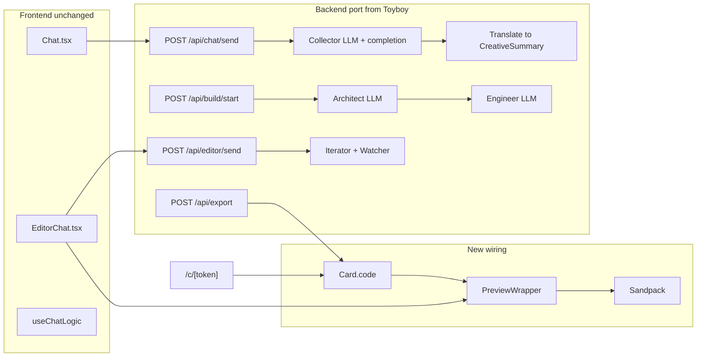

# Toyboy logic port and cursor-rules lifecycle

## Principles (non-negotiable)

- **Codebase is source of truth**: [src/](src/), [docs/MASTER_PROMPT_BACKEND.md](docs/MASTER_PROMPT_BACKEND.md), and [.cursor/rules/](.cursor/rules/) define behavior. Toyboy reference is used only for proven implementation details (env vars, API shapes, code patterns).
- **Frontend is preserved**: Do not replace [Chat.tsx](src/components/Chat.tsx), [EditorChat.tsx](src/components/EditorChat.tsx), [useChatLogic.ts](src/hooks/useChatLogic.ts), or page structure. Only wire them to real backend and add a single preview component where the spec already calls for it (Section_editor_canvas).
- **Master prompt and flows**: All behavior must align with [docs/MASTER_PROMPT_BACKEND.md](docs/MASTER_PROMPT_BACKEND.md) (four agents, three flows, element map, modals, notifications). Toyboy concepts (e.g. “Cupid”, “Toy Boy”) are not copied; cardz product language and agent roles (Collector, Architect, Engineer, Iterator) stay.

---

## 1. Cursor rule: creating, updating, and maintaining cursor rules

**Goal:** One dedicated rule that defines a rigorous process so rule changes are consistent and traceable.

**New file:** [.cursor/rules/cursor-rules-lifecycle.mdc](.cursor/rules/cursor-rules-lifecycle.mdc)

**Content to require:**

- **Single concern:** Each rule covers one domain (styling, API, flows, etc.); no mega-rules.
- **Proposal step:** New or materially changed rules are proposed (e.g. in a plan or PR description) before editing. Rationale and impact on existing rules and [docs/MASTER_PROMPT_BACKEND.md](docs/MASTER_PROMPT_BACKEND.md) must be stated.
- **No duplication:** Rules must not restate the master prompt; they reference it. Overlap with [element-maps.mdc](.cursor/rules/element-maps.mdc), [flows.mdc](.cursor/rules/flows.mdc), [modals-variants.mdc](.cursor/rules/modals-variants.mdc), etc. is avoided; if a rule affects flows or element map, the master doc is updated instead of inlining full tables.
- **Location and format:** All rules live in `.cursor/rules/`, `.mdc` with YAML frontmatter (per [cursor-rules.mdc](.cursor/rules/cursor-rules.mdc) and create-rule skill). Naming: kebab-case.
- **When to update:** Adding a new screen, modal, or flow requires master prompt (and optionally flow diagrams) and element map updates; rule changes that affect behavior require a note in the plan/PR.
- **Versioning:** Rules are the live source; no separate “version file” unless the team introduces one. Changes are tracked via git.

The rule should be concise (&lt; 80 lines), reference the create-rule skill and [cursor-rules.mdc](.cursor/rules/cursor-rules.mdc), and list which existing rules it coordinates with (flows, element-maps, flow-diagrams-deliverables, directory-structure-naming).

---

## 2. High-level mapping: Toyboy → cardz

| Toyboy | Cardz (current / target) |

| ----------------------------------------------- | ---------------------------------------------------------------------------------------------------------------------- |

| CupidChat + /api/cupid-chat | [Chat](src/components/Chat.tsx) + [POST /api/chat/send](src/app/api/chat/send/route.ts); Collector agent |

| Transcript → translate → generate-code | Creative summary → Architect (blueprint) → Engineer (code); [build-flow](src/lib/build-flow.ts) |

| BuilderEnvironment (preview + iterate + deploy) | [EditorChat](src/components/EditorChat.tsx) (preview + iterate) + export (payment then share); no separate “deploy” UI |

| PreviewWrapper + Sandpack | **New:** PreviewWrapper; Section_editor_canvas in EditorChat |

| POST /api/deploy → Supabase experiences | Export flow: persist **code** with Card (or experiences table); share URL = `/c/[token]` |

| Share page (SSR, fetch by id) | [app/c/[token]/page.tsx](src/app/c/[token]/page.tsx): claim then render PreviewWrapper with card’s code |

| /api/webhook-proxy | Optional: add for generated card actions (e.g. receiver submit → notify); env `WEBHOOK_URL` |

Cardz already has: session, build, artifact, Card, chat/send, chat/approve, build/start, build/[buildId], editor/send, editor/usage, export, card/claim. What’s missing is **real LLM usage**, **real React code** in `BuildArtifact.code`, **Sandpack preview**, and **persisting and serving that code** for the share link.

---

## 3. Dependencies and environment

- **Add (from Toyboy):** `@google/generative-ai`, `openai`, `@codesandbox/sandpack-react`, `uuid`. Optional: `@supabase/supabase-js` if storing code in Supabase.
- **Env (from Toyboy, names can be aligned):**
  - `GOOGLE_GENAI_API_KEY` (Gemini)
  - `MODEL_PROVIDER` (e.g. `GOOGLE` | `OPEN_AI`)
  - `OPENAI_GENAI_API_KEY` (if OpenAI used)
  - `NEXT_PUBLIC_APP_URL` or `NEXT_PUBLIC_BASE_URL` for share URLs (already one of these in [export/route.ts](src/app/api/export/route.ts))
  - Optional: `WEBHOOK_URL` for webhook-proxy.
- **Do not add:** Toyboy-specific env (e.g. n8n URLs) except as optional proxy target; no “Cupid” or “Toy Boy” in prompts.

---

## 4. Backend port (logic only)

### 4.1 Collector (Agent 1)

- **Current:** [collector.ts](src/lib/agents/collector.ts) uses hardcoded replies and a trivial `extractCreativeSummary` (no LLM).
- **Port:**
  - **Persist collector messages** in session (e.g. add `collectorMessages: ChatMessage[]` to [Session](src/lib/types.ts) and update [store](src/lib/store.ts)); [chat/send](src/app/api/chat/send/route.ts) appends user message, then runs **one LLM call** with full history (Toyboy-style: messages with `role` + `parts[{ text }]`), then a **completion check** (prompt that requires a fixed set of data points).
  - **Data points** aligned to [CreativeSummary](src/lib/types.ts): e.g. recipient name, sender name, vibe, central subject (avatar or object), tone, product confirmed, etc.
  - **Completion check response:** JSON `{ hasEnoughInfo, missingPoints }`; strip markdown/code fences and parse (reuse Toyboy’s robust cleaning).
  - When `hasEnoughInfo`: either (a) run a **translate** step (transcript → CreativeSummary-shaped JSON) and map to `CreativeSummary`, or (b) extend completion-check output to return structured fields that map to `CreativeSummary`. Store in session; return AI message and `showConfirmation: true` so existing Chat UI shows “approve”.
- **Contract:** [ChatSendBody](src/lib/types.ts) stays `{ sessionId, text }`; response [ChatSendResponse](src/lib/types.ts) unchanged (`messages`, optional `popTrigger`). No change to frontend request shape.

### 4.2 Architect (Agent 2)

- **Current:** [architect.ts](src/lib/agents/architect.ts) returns a static blueprint from `CreativeSummary`.
- **Port:**
  - **Single LLM call:** Input = creative summary (and optionally transcript snippet); output = **Blueprint-shaped JSON** (heading, description, statusBar, centralImage, buttons, primaryBackground, secondaryBackground, textColor, themeName) matching [Blueprint](src/lib/types.ts) and [ButtonSlot](src/lib/types.ts).
  - Reuse Toyboy’s **translate** pattern: clear system prompt, “return only valid JSON”, strip code fences, `JSON.parse`.
  - Keep [creativeSummaryToBlueprint](src/lib/agents/architect.ts) as the public API; implement it by calling this LLM (or an internal helper) and validating/mapping into `Blueprint`.

### 4.3 Engineer (Agent 3)

- **Current:** [engineer.ts](src/lib/agents/engineer.ts) emits a text template (e.g. `heading:...\nbuttons:...`), not runnable UI.
- **Port:**
  - **Single LLM call:** Input = Blueprint (JSON); output = **one React `App.tsx`** (Tailwind + Framer Motion, matching cardz product: central component, 1–4 buttons, modals as needed).
  - Reuse Toyboy’s **generate-code** prompt structure and **post-processing**: strip code fences, kebab-case SVG → camelCase, remove CSS imports, fix HTML comments → JSX, ensure React/motion/lucide imports, sanitize malformed `style={{}}`.
  - **Contract:** [BuildArtifact](src/lib/types.ts) keeps `{ code, blueprint, createdAt, previousCode }`; `code` becomes the **full React component string** (so Sandpack can run it).
  - [blueprintToCode](src/lib/agents/engineer.ts) and [realignCode](src/lib/agents/engineer.ts) call this generator; realign can pass previous code + blueprint for “realignment” prompt when Watcher triggers.

### 4.4 Iterator (Agent 4) and Watcher

- **Current:** [iterator.ts](src/lib/agents/iterator.ts) does keyword-based blueprint tweaks and stub replies; [watcher.ts](src/lib/agents/watcher.ts) does line-diff and realign.
- **Port (phase 1):** Keep **Watcher** as-is (diff threshold, realign via Engineer). **Iterator:** optionally add an LLM call to interpret user text and produce a **blueprint delta** (or updated blueprint) so [applyIteration](src/lib/agents/iterator.ts) and [getIteratorReply](src/lib/agents/iterator.ts) are smarter; if time-boxed, keep current heuristic and improve in a follow-up.
- **Contract:** [EditorSendBody](src/lib/types.ts) / [EditorSendResponse](src/lib/types.ts) unchanged; editor/send still returns `messages` and `build` with updated `artifact`.

### 4.5 Shared LLM layer

- **Add** a small lib (e.g. `src/lib/llm.ts` or under `src/lib/agents/`) that:
  - Reads `MODEL_PROVIDER`, `GOOGLE_GENAI_API_KEY`, `OPENAI_GENAI_API_KEY`.
  - Exposes a single interface (e.g. `generate(params: { messages or prompt, systemInstruction?, responseFormat? })`) that calls Gemini or OpenAI (Toyboy’s cupid-chat/translate/generate-code pattern).
- Reuse Toyboy’s model names or align to current availability (e.g. `gemini-2.5-flash-lite` / `gpt-4o-mini` for JSON). No new env beyond what’s above.

---

## 5. Preview and share (UI wiring only)

### 5.1 PreviewWrapper

- **New component:** [src/components/PreviewWrapper.tsx](src/components/PreviewWrapper.tsx).
  - **Props:** `code: string`.
  - **Logic (from Toyboy):** Client-only; `apiBaseUrl = window.location.origin`; `processCode(rawCode)` replaces hardcoded webhook URLs with `apiBaseUrl + '/api/webhook-proxy'` (if you add that route).
  - **Render:** [Sandpack](https://sandpack.codesandbox.io/) with template `react-ts`, single file `/App.tsx` = processed code, dark theme, dependencies `react@^19`, `react-dom@^19`, `framer-motion`, `lucide-react`, Tailwind via CDN; editor hidden, no tabs/console, full-height preview.
- **Styling:** Wrap in a container that fits [Section_editor_canvas](src/components/EditorChat.tsx) (glassmorphism optional; match existing layout).

### 5.2 EditorChat preview wiring

- **Current:** [Section_editor_canvas](src/components/EditorChat.tsx) is a static placeholder (empty white div).
- **Change:**
  - EditorChat already has `sessionId` and `buildId`. Add state or fetch for **build** (e.g. poll [GET /api/build/[buildId]](src/app/api/build/[buildId]/route.ts) until `status === 'ready'`, or receive artifact from parent).
  - When `build?.artifact?.code` exists, render **PreviewWrapper** inside Section_editor_canvas (replace or wrap the placeholder).
  - When build is pending or no code, show loading or placeholder so the layout remains.
- **No other EditorChat UI changes:** Same chat, same buttons, same modals.

### 5.3 Persist code on export and serve on /c/[token]

- **Export ([api/export/route.ts](src/app/api/export/route.ts)):** Today it creates a [Card](src/lib/types.ts) with `buildId`, `shareToken`, `passphrase` but does not store the built **code**.
  - **Option A:** Add `code: string` (and optionally `blueprint`) to **Card** in [types](src/lib/types.ts) and [store](src/lib/store.ts). On export, set `card.code = build.artifact.code` (and optionally `card.blueprint`).
  - **Option B:** Add a separate store (e.g. Supabase `experiences` or a `card_code` table) keyed by `shareToken` or `cardId`, and store `code` there; Card stays as-is.
- **Receiver route ([app/c/[token]/page.tsx](src/app/c/[token]/page.tsx)): **After claim and `claimStatus === 'active'`, **load the card** (and its code, from store or from experiences). If code exists, render **PreviewWrapper** with that code in the main content area (replace “Card content would render here”). If no code, show a fallback message.
- **Share URL:** Remain `NEXT_PUBLIC_APP_URL` / `NEXT_PUBLIC_BASE_URL` + `/c/${shareToken}` (already used in export).

### 5.4 Webhook proxy (optional)

- If the **generated** card is instructed to POST to the same origin (e.g. for “receiver submitted” or future n8n), add [api/webhook-proxy/route.ts](src/app/api/webhook-proxy/route.ts): POST body forwarded to `WEBHOOK_URL`; CORS for POST/OPTIONS. Env `WEBHOOK_URL` optional; omit if not needed for v1.

---

## 6. What we do not do

- Do **not** introduce Toyboy-specific copy (“Cupid”, “Toy Boy”, “digital action figure” in prompts) unless product explicitly adopts it.
- Do **not** replace Chat or EditorChat with Toyboy’s CupidChat or BuilderEnvironment; only augment backend and add PreviewWrapper + wiring.
- Do **not** add Toyboy’s share route `/share/[id]`; cardz uses `/c/[token]` and claim flow.
- Do **not** change master prompt flows or element map except where we add PreviewWrapper / Section_editor_canvas behavior and any new env vars; document those in the master doc or README.

---

## 7. Order of implementation (suggested)

1. **Cursor rule** – Add [cursor-rules-lifecycle.mdc](.cursor/rules/cursor-rules-lifecycle.mdc) and, if needed, a one-line reference in [cursor-rules.mdc](.cursor/rules/cursor-rules.mdc) or master doc.
2. **Deps and env** – package.json + `.env.example` (or README) listing required and optional env.
3. **LLM layer** – `src/lib/llm.ts` (or equivalent) with Gemini/OpenAI and completion-check parsing.
4. **Collector** – Persist collector messages; wire chat/send to LLM + completion check; translate or map to CreativeSummary when complete.
5. **Architect** – LLM-based creativeSummaryToBlueprint (Blueprint-shaped JSON).
6. **Engineer** – LLM-based blueprintToCode (React App.tsx) + post-processing; keep realignCode.
7. **PreviewWrapper** – New component; Sandpack + processCode.
8. **EditorChat** – Fetch build by buildId; render PreviewWrapper when artifact.code exists.
9. **Export + Card** – Persist code on Card (or experiences); keep existing export API and payment/sign-up semantics.
10. **Receiver page** – Load code for claimed card; render PreviewWrapper when active.
11. **Optional** – Iterator LLM improvements; webhook-proxy route.
12. **Docs** – Master prompt / element map: document PreviewWrapper, Section_editor_canvas behavior, env vars; update plan in [.cursor/plans/](.cursor/plans/) if the plan file is the living checklist.

---

## 8. Diagram (agent + data flow)

This plan keeps the codebase as source of truth, preserves the frontend, and uses Toyboy only for proven implementation patterns (LLM calls, completion check, translate/code-gen prompts, Sandpack, code persistence and share rendering). The new cursor rule ensures future rule changes follow a single, rigorous lifecycle.
