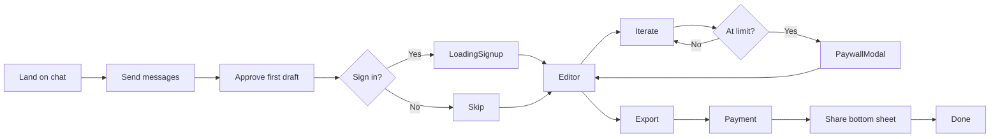
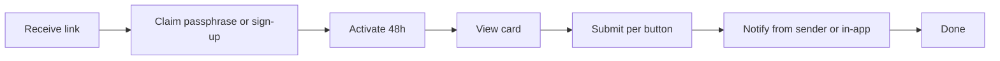
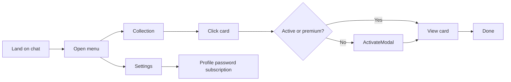

# Master Prompt: Backend and Front-End Specification

**Source of truth for the three user flows, four agents, routes, components, and backend behavior.**  
Implementation and automation must align with this document and with `.cursor/rules/` (ui-styling, flows, modals, notifications, directory structure).

---

## 1. Purpose and design reference

- **Product**: Cardzzz — creative assistant chat that produces shareable, interactive cards. Sender has a short conversation (Collector), approves a creative summary, then receives a built card; they iterate in the editor, export, and share. Receiver claims and activates the card for 48 hours; returning users access library and settings.
- **Design**: Typography, glassmorphism, and button states are defined in `.cursor/rules/ui-styling.mdc`. All Roundo text is lowercase; Satoshi for body/labels.
- **Backend agents**: Exactly four, in order: **Collector** (Agent 1) → **Architect** (Agent 2) → **Engineer** (Agent 3) → **Iterator** (Agent 4). Definitions and I/O are in §9.

---

## 2. Routes and components

| Route | Page | Main component |
|-------|------|----------------|
| `/` | `src/app/page.tsx` | `Chat` (`@/components/Chat`) |
| `/dev/pipeline` | `src/app/dev/pipeline/page.tsx` | `DevPipelinePage` (dev-only) |
| `/dev/pipeline/preview` | `src/app/dev/pipeline/preview/page.tsx` | Preview page + `PreviewWrapper` (dev-only) |
| `/c/[token]` | `src/app/c/[token]/page.tsx` | Private card view (receiver) |
| `/collection` | (as defined in app) | `Collection` |
| `/collection-with-cards` | (as defined in app) | `CollectionWithCards` (library) |
| `/settings` | (as defined in app) | `Settings` |

**Shared components (all in `src/components/`):**  
`Chat`, `EditorChat`, `LoadingSignup`, `NavMenuModal`, `PaywallModal`, `ActivateModal`, `AuthModal`, `PreviewWrapper`, `Collection`, `CollectionWithCards`, `Settings`.

**Hooks:** `useChatLogic` in `src/hooks/useChatLogic.ts`.  
**No** `_quarantine` or `Raw`-prefixed components; all live under `src/components/` per `.cursor/rules/directory-structure-naming.mdc`.

---

## 3. Sender flow and element map

1. **Land on chat** (`/`) — `Chat` component. User types in Section_Input, sends with Comp_Button-Primary "send". Backend: create session, Collector (Agent 1) responds until first draft is ready.
2. **First draft ready** — AI shows confirmation request with **approve** button. Optional sign-in modal; skip → optional "Are you sure? Session may not persist" confirmation.
3. **After approve** — Sign up → `LoadingSignup`; Skip → go to editor. Backend: approve persists creative summary, triggers Architect → Engineer (build).
4. **Editor** — `EditorChat`: preview (Section_editor_canvas), chat "final touches?", send. Iteration limit → `PaywallModal` ($5). Backend: Iterator (Agent 4); rebuild when threshold exceeded.
5. **Export** — Comp_Export_Request "export". Not signed in → sign-up then payment; signed in → payment. Backend: Lemon Squeezy; after payment generate shareable link.
6. **Share** — Bottom sheet: email, WhatsApp, iMessage. Backend: store share method; optional rich preview.

**Element map (sender):**

| Page/Modal | Component (file) | Element (class or label) | Action | Backend |
|------------|-----------------|--------------------------|--------|---------|
| Chat | Chat.tsx | Comp_Button-Primary "send" | Send message | POST /api/chat/send, Collector |
| Chat | Chat.tsx | Comp_Button-Primary "approve" | Approve first draft | POST /api/chat/approve, session/build |
| Editor | EditorChat.tsx | Comp_Button-Primary "send" | Send iteration | Iterator, rebuild if needed |
| Editor | EditorChat | Export request "export" | Start export | Sign-up/payment then export |
| PaywallModal | PaywallModal.tsx | Comp_Paywall_Button $5 | Pay to continue | Payment, then continue |
| NavMenuModal | NavMenuModal.tsx | Comp_NavMenu_Link "create" \| "collection" \| "settings" | Navigate | Route change |

---

## 4. Receiver flow and element map

1. **Entry** — Link (email/WhatsApp/iMessage) → private card view (e.g. `/c/[token]`).
2. **Claim** — Passphrase or sign-up to claim. Backend: validate passphrase or create account; lock card to user.
3. **Activate** — Activate card for 48 hours. Backend: set active, set expiry.
4. **View card** — Interactive buttons. On submit (if button has notification): backend sends from sender (WhatsApp/email or in-app only). Show "check your inbox soon" when channel used.

**Element map (receiver):** Claim (passphrase/sign-up), Activate CTA, per-button submit, loading state. Backend: claim/lock, activation, 48h window, notification dispatch per `.cursor/rules/notifications-backend.mdc`.

---

## 5. Returning user flow and element map

1. **Land on chat** (`/`) — Same as sender. Comp_menu_button → `NavMenuModal` → "collection" → library; "settings" → Settings.
2. **Library** — `CollectionWithCards`: sent/received toggle, card grid. Click card → if active/premium: view; if expired: `ActivateModal` ($5 or subscribe).
3. **Settings** — Profile, password, subscription, notifications, export data, delete account. Backend: Lemon Squeezy for subscription.

**Element map (returning):** Comp_menu_button, Comp_NavMenu_Link, Comp_Toggle_Option sent/received, Comp_card_preview click → card status/activate, ActivateModal $5/close, Settings sections and buttons.

---

## 6. Modals and variants

- **NavMenuModal**: Dropdown; create, collection, settings. See `.cursor/rules/modals-variants.mdc`.
- **PaywallModal**: "Limit reached", $5. Variants: not signed up vs signed up. Used at iteration limit and at export.
- **ActivateModal**: "Reactivate dream-card", $5 or subscribe. Expired card in library.
- **LoadingSignup**: Full-screen sign-up; loading phases; navigates to editor.
- New modals (e.g. sign-in prompt, skip confirmation) go in `src/components/` with glassmorphism and button styles from ui-styling.mdc.

---

## 7. Notifications and async behavior

- **Per-button options (exactly three):** (1) User’s WhatsApp, (2) User’s email, (3) In-app only. See `.cursor/rules/notifications-backend.mdc`.
- **Async:** Sending runs as async jobs; no blocking UI. Optional "check your inbox soon" and in-app mirror.

---

## 8. Security and reuse

- **Auth:** Strong session; optional device fingerprint for anonymous → signed-in handoff.
- **Data:** Encrypt at rest and in transit; no secrets in client or logs.
- **Reuse:** New screens/modals reuse patterns from `src/components/` and ui-styling.mdc. Import from `@/components/` and `@/hooks/` only.

---

## 9. Four agents (backend)

| Agent | Role | Input | Output |
|-------|------|--------|--------|
| **Collector** (Agent 1) | Chat; gather "just enough" for a creative summary | Session, messages | Creative summary (or transcript for Architect), completion trigger |
| **Architect** (Agent 2) | Map summary or transcript to fixed blueprint | CreativeSummary or transcript | Blueprint JSON |
| **Engineer** (Agent 3) | Generate React card code from blueprint | Blueprint, optional previous code, errorContext | BuildArtifact (code) |
| **Iterator** (Agent 4) | Editor chat; minor iterations; decide rebuild | User message, current artifact | Reply, optional blueprint/code update |

Implementations: `src/lib/agents/collector.ts`, `architect.ts`, `engineer.ts`, `iterator.ts`. Build flow: `src/lib/build-flow.ts`.

**Tone, style, engagement, shortfalls, and single-task direction** for reproducibility and prompt refinement are documented in **`docs/AGENTS.md`**. That document is the working snapshot for recreating agent behavior and steering outputs; update it whenever agent prompts or I/O change.

---

## 10. Required flow diagrams (Mermaid)

### Sender flow

### Receiver flow

### Returning user flow

---

*This document is the canonical spec. When adding screens, modals, or flows, update the element map and flow diagrams here and in the relevant cursor rules.*
