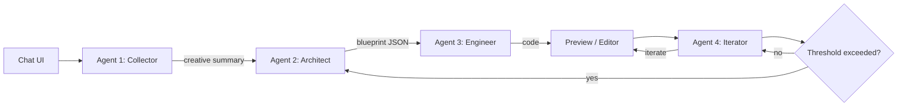
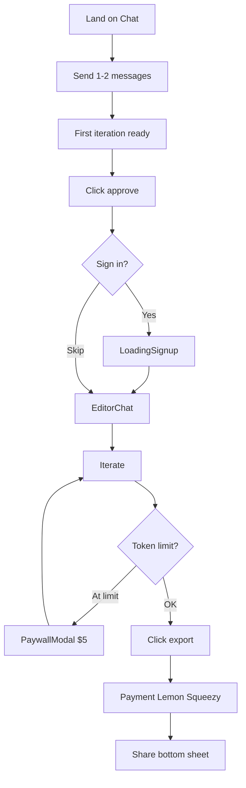
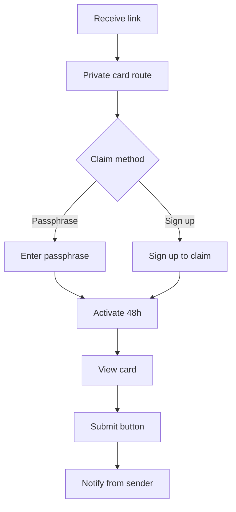
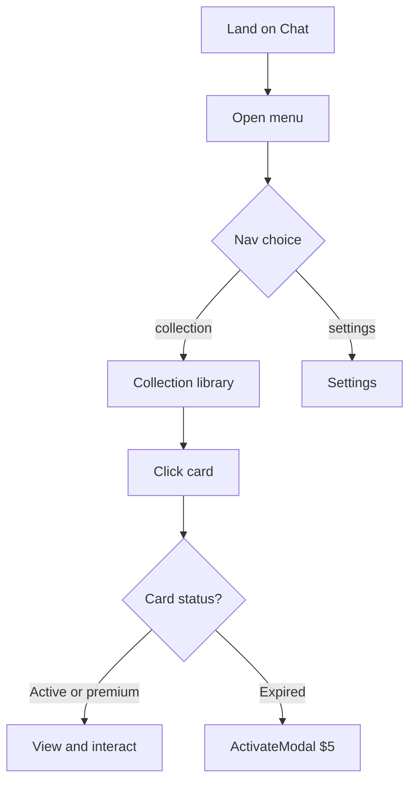

# Master Prompt: Backend Logic and Front-End Mapping

This document is the single source of truth for implementing the backend and wiring every button and flow. It maps the three user flows (sender, receiver, returning user) to exact front-end elements and backend behavior so that implementation can be done in one pass with no ambiguity.

**Tone (mandatory):** When this document says **MUST**, **thou shalt**, or **the backend MUST**, there is **no room for interpretation**. You must do the thing. No optional reading of requirements.

**Design and structure references:** All UI must follow [.cursor/rules/ui-styling.mdc](.cursor/rules/ui-styling.mdc) (typography, glassmorphism, button states, naming `Comp_`, `Layout_`, `Chat_`) and [.cursor/rules/cursor-rules.mdc](.cursor/rules/cursor-rules.mdc). New screens or modals must reuse or replicate patterns from existing components in `src/components/` and the hooks in `src/hooks/`. See also: [.cursor/rules/directory-structure-naming.mdc](.cursor/rules/directory-structure-naming.mdc), [.cursor/rules/flows.mdc](.cursor/rules/flows.mdc), [.cursor/rules/element-maps.mdc](.cursor/rules/element-maps.mdc), [.cursor/rules/modals-variants.mdc](.cursor/rules/modals-variants.mdc), [.cursor/rules/notifications-backend.mdc](.cursor/rules/notifications-backend.mdc), [.cursor/rules/non-functional-requirements.mdc](.cursor/rules/non-functional-requirements.mdc), [.cursor/rules/flow-diagrams-deliverables.mdc](.cursor/rules/flow-diagrams-deliverables.mdc).

---

## 1. Purpose and design reference

- **Purpose**: Deconstruct the product into sender, receiver, and returning user flows; map every meaningful button and interaction to exact UI elements (component, file, class/label); specify backend behavior (auth, payment, iteration limits, notifications, async jobs, security) so the backend can be implemented in one pass.
- **Design**: Single source of truth for visual and interaction design is [.cursor/rules/ui-styling.mdc](.cursor/rules/ui-styling.mdc). All new or replicated screens/modals MUST adhere to it. Reuse components from `src/components/` (e.g. LoadingSignup, PaywallModal, ActivateModal, NavMenuModal) and extract shared pieces (e.g. Comp_Button_Primary) where it avoids duplication.

---

## 2. Routes and components

**Routes and main components (post–housekeeping):**

| Route                    | Page component                          | Main component                                      |
| ------------------------ | --------------------------------------- | --------------------------------------------------- |
| `/`                      | `src/app/page.tsx`                      | `Chat` from `src/components/Chat.tsx` (landing)     |
| `/collection`            | `src/app/collection/page.tsx`           | `Collection` from `src/components/Collection.tsx`   |
| `/collection-with-cards` | `src/app/collection-with-cards/page.tsx`| `CollectionWithCards` from `src/components/CollectionWithCards.tsx` |
| `/settings`              | `src/app/settings/page.tsx`             | `Settings` from `src/components/Settings.tsx`        |

**Modals / full-screen flows:**

- **When signed in:** **NavMenuModal** (`src/components/NavMenuModal.tsx`) is shown (e.g. via `Comp_menu_button`). Links: "create" → `/`, "collection" → `/collection-with-cards`, "settings" → `/settings`. Rendered from Chat, EditorChat, Collection, CollectionWithCards, Settings.
- **When NOT signed in:** Do **not** show the menu. Instead show **Sign in** and **Sign up** buttons in the navbar/chrome (same positions or area where the menu would be). Library (collection) and Settings are not available until the user signs in; chat and editor remain usable anonymously.
- **PaywallModal** (`src/components/PaywallModal.tsx`): "limit reached", $5 CTA; used from chat/editor when iteration limit hit (and at export if needed).
- **ActivateModal** (`src/components/ActivateModal.tsx`): "reactivate dream-card" $5 or subscribe; used when opening an expired card in library (CollectionWithCards).
- **LoadingSignup** (`src/components/LoadingSignup.tsx`): Sign-up form (name, email, password) + "create account" button; loading phase with rotating phrases; then navigates to editor.

**Chat logic:** `useChatLogic` (`src/hooks/useChatLogic.ts`): Message types `confirmation`, `export`; triggers for "confirmation" / "export" / "pop" (paywall). Backend uses real session and LLM (Collector, Architect, Engineer, Iterator) per §5.

**Preview:** **PreviewWrapper** (`src/components/PreviewWrapper.tsx`): Renders generated card code in **Section_editor_canvas** (EditorChat) and on the receiver view (`/c/[token]`). Client-only; uses Sandpack (react-ts, Tailwind CDN, framer-motion, lucide-react). EditorChat polls `GET /api/build/[buildId]` and shows PreviewWrapper when `build.artifact.code` exists. Receiver view receives `code` in the claim response and renders PreviewWrapper when active.

**Library:** In product terms, **library** is the collection-with-cards view. The menu item "collection" goes to `/collection-with-cards`. `/collection` can remain as an empty state or be redirected; the doc leaves that to implementation choice.

---

## 3. Sender flow (step-by-step with element map)

Documentation standard: Each step is a **standard operating procedure (SOP)**. For every step include: **screen/component name**, **file path**, **exact button label or class**, **user action**, **backend requirement** (API, persistence, job queue), and where helpful a short **rationale**. Over-communicate so the process is reproducible and automatable.

**Agent mapping (see §5):** Steps 1–2 = **Collector (Agent 1)**. After approve, **Architect (Agent 2)** and **Engineer (Agent 3)** run (creative summary → blueprint → code). Step 4 (editor chat) = **Iterator (Agent 4)**. Rebuilds re-run Architect → Engineer when threshold exceeded.

1. **Land on chat**  
   - **Screen:** Chat. **File:** `src/components/Chat.tsx`.  
   - **Elements:** `Section_Input` (textarea placeholder "Type your reply..."), `Comp_Button-Primary` (label "send"), `Comp_Attach`, `Comp_Voice`.  
   - **Action:** User types and clicks "send".  
   - **Backend:** Create session (anonymous if not signed in). **Collector (Agent 1)** MUST drive this chat: send 1–2 messages to get "just enough" for first iteration; output creative summary when complete. Persist conversation and session (e.g. device ID for anonymous handoff).

2. **First iteration ready — confirmation**  
   - **Screen:** Chat. **File:** `src/components/Chat.tsx`.  
   - **Elements:** `Comp_Confirmation_Request` (Chat_bubble_ai) with button **"approve"** (`Comp_Button-Primary_approve`).  
   - **Action:** User clicks "approve".  
   - **Backend:** Persist approval; associate draft/card with session.  
   - **Optional sign-in modal:** Show "Do you want to sign in? All changes will be saved and you can come back." **Yes** → go to LoadingSignup flow; **No** → "Skip for now" → optional **confirmation modal**: "Are you sure? Your session may not persist if you close or reload." Buttons: **Sign up** (then sign-up flow) or **Yes** (continue without account).  
   - **Rationale:** Optional sign-in keeps fast path for one-off users while offering account persistence.

3. **After approve (or skip)**  
   - **Sign up chosen:** Show LoadingSignup (`src/components/LoadingSignup.tsx`). User fills name, email, password and clicks "create account". Backend MUST create account, then run **Architect (Agent 2)** on the creative summary → **Engineer (Agent 3)** on the blueprint → build; when ready, user lands in editor.  
   - **Skip chosen:** Go straight to EditorChat. Backend MUST keep session (e.g. anonymous + device ID) and run Architect → Engineer to produce the first build.  
   - **Screen transition:** Either `LoadingSignup` (then editor when ready) or `EditorChat` (`src/components/EditorChat.tsx`).

4. **Editor (iterate)**  
   - **Screen:** EditorChat. **File:** `src/components/EditorChat.tsx`.  
   - **Elements:** `Section_editor_canvas` (preview), `Section_chat_interface` with heading "final touches?", same input + `Comp_Button-Primary` "send".  
   - **Action:** User iterates in chat; optionally reveal more customization in copy.  
   - **Backend:** **Iterator (Agent 4)** MUST drive this chat. It MUST change only what the user asked; keep structure consistent; suggest options progressively; if change exceeds rebuild threshold, re-run Architect → Engineer (see §5).  
   - **Iteration limit:** Token-cost cap — **~$0.50 new user**, **~$1.50 super user**. At limit, show **PaywallModal** (`Comp_Paywall_Button` "$5"). Backend MUST track token usage and enforce cap; return limit-reached when cap exceeded.  
   - **Rationale:** Prevents abuse while allowing generous free usage.

5. **Export**  
   - **Screen:** EditorChat. **Elements:** `Comp_Export_Request` with button **"export"** (`Comp_Button-Primary_export`).  
   - **Action:** User clicks "export".  
   - **Backend:** If **not signed up** at this point → user MUST sign up (show sign-up modal, e.g. LoadingSignup). After sign-up (or if already signed in) → show **payment modal** (Lemon Squeezy). **Payment required before successful export** via Lemon Squeezy only. After payment: generate shareable link and passphrase; persist card (e.g. in `cards` table); then show share experience (bottom sheet with link and passphrase).  
   - **Rationale:** Monetization and access control at the moment of value (sending the card).

6. **Share experience**  
   - **Action:** User clicks share. A **bottom sheet** MUST slide up from the bottom. The **whole panel** is dismissible by clicking outside or sliding down (not a small bar). The sheet presents **native-feel options** (email, WhatsApp, iMessage, etc.). Use a library or build from scratch; document the chosen approach. Optional **rich preview** (e.g. Spotify-style card) for the link in the shared message.  
   - **Backend:** Provide share URL and optional metadata for preview; if passphrase is used (receiver flow), generate and return passphrase for the sender to include in their private message.

7. **Per-button notifications (builder chat)**  
   - When a button can trigger a notification, the user has **exactly three options**: (1) **Authenticate through your own WhatsApp** (messages from user’s WhatsApp); (2) **Authenticate through your own email** (messages from user’s email); (3) **In-app only** (experience appears only in-app, no external notification).  
   - **Backend:** Store chosen option and contact (email or number) per button for when the receiver triggers it. No "from us only" option.

---

## 4. Receiver flow (private route)

The receiver experience is a **private route**. The link alone MUST NOT grant access; the receiver must **claim** the card (passphrase or sign-up) before viewing.

1. **Entry**  
   - Receiver gets link (email, WhatsApp, or iMessage). Link goes to a **private card view** (e.g. `/c/[cardId]` or `/r/[token]` — to be defined; no existing component yet).  
   - **Backend:** Route MUST require claim before showing card content. Link is addressable but not public; bots may hit the URL, so access MUST depend on passphrase or sign-up.

2. **Claim / unlock**  
   - **Option A — Passphrase:** When sender shares, a secret passphrase is generated and sent only in the private message with the link. Receiver enters it to unlock (brand as "secret passphrase to enter the experience"). Backend MUST validate passphrase and then activate for the claimant.  
   - **Option B — Sign up to claim:** First open shows e.g. "Sign up to claim the card"; receiver provides email/password to claim and lock the card (wording: "unlock your experience"). Backend MUST create account (or sign in), bind the card to that user, and then activate.  
   - **Rationale:** Prevents unauthorized access and ensures only the intended receiver can open the card.

3. **After claim**  
   - **Backend:** Activate card for **48 hours**; mark active, set expiry, lock to that user. Show **welcome message** (clear, separate from card content).

4. **Card UI**  
   - View card; **interactive buttons**. If a button has notification and receiver **submits** (e.g. submit on an input): backend MUST send message **from the sender** (WhatsApp or email as configured). Show "check your inbox soon" (or similar). Optionally show same content in-app after short delay.  
   - **Loading:** When an action is in progress (e.g. generating audio), show **non-blocking loading** (e.g. "cooking" / Lottie-style). User can stay on page; optionally notify when done. Reuse or mirror LoadingPhrases pattern from LoadingSignup.

**Auth spaces:** **Chat** and **editor** = usable without sign-in (anonymous or signed-in). **Library (collection)** and **profile/settings** = require sign-in; if the user is not signed in, the menu is not shown and they see Sign in / Sign up instead. Build state and session are persisted for anonymous users (e.g. device ID) so they can complete the flow and are prompted to sign up at export if not already.

---

## 5. Agent architecture (four agents)

The backend MUST implement exactly four agents. Their order and handoffs are fixed. When this document says an agent MUST do something, there is no room for interpretation: thou shalt do the thing.

**Definitions (mandatory):**

- **Sender** = the creator of the card (the user in the build/editor flow).
- **Receiver** = the person who receives the card; once they have it, they are the **ultimate guide** of the experience (they control and unpack it).

### Agent 1: Collector

- **Role:** Gather “just enough” information from the sender in the initial chat. Output a **creative summary** (structured text or JSON) that the Architect can turn into a blueprint.
- **Location:** The first chat screen (landing). **File:** Chat logic and backend session that drives `src/components/Chat.tsx`.
- **MUST:**
  - Keep the initial conversation short (e.g. 1–2 substantive exchanges). Do NOT require a long questionnaire before showing a first draft.
  - Extract: who the card is for (receiver), who the sender is, the vibe the sender wants to portray, and what delivers the experience (avatar **or** an inanimate object: card, orb, chest, playing card, etc.). The center is not only “avatar”; it can be any creative subject the sender chooses.
  - Confirm product understanding briefly (e.g. “You’re creating an experience the receiver will control. Ready to build?”) without walls of text.
  - Output a **creative summary** in a defined format (e.g. JSON) that contains exactly what the Architect needs. The Collector MUST NOT hand off until it has enough to produce that summary; completion criteria MUST be enforced (e.g. proof-of-concept / “are you cool with this first draft?”).
- **Handoff:** Creative summary → **Agent 2 (Architect)**. No code is generated at this stage.

### Agent 2: Architect (Translator)

- **Role:** Take the Collector’s creative summary and map it to a **variable schema** (JSON) that defines the card: layout, colors, copy, central component, buttons, etc. This schema is the **blueprint** for the Engineer.
- **MUST:**
  - Consume only the creative summary (and any approved first-draft confirmation). Produce a single, rich JSON schema (e.g. heading, description, status bar, central image/avatar, one to four buttons, with types and layout rules).
  - Support a fixed set of variable “slots” (e.g. limited variables such as heading, description, status bar, central image, 1–4 buttons). Buttons MAY be text-only, or include at most one music and one image-manipulation button; layout for 2 or 3 buttons MUST follow defined rules (e.g. no “one here, two there, one missing”); 4 buttons MUST be laid out consistently.
  - Map open-ended creative intent (e.g. “any color”, “any vibe”) into those variable slots so the template remains generative but structurally consistent.
- **Handoff:** Variable schema (blueprint) → **Agent 3 (Engineer)**. No direct user chat at this stage.

### Agent 3: Engineer

- **Role:** Generate the actual code (e.g. the card UI / mini-app) from the Architect’s blueprint.
- **Input:** The JSON variable schema from the Architect.
- **Output:** Built artifact (e.g. HTML/React or deployed preview) that the sender sees in the **preview/editor**.
- **MUST:** Produce code that respects the variable schema and the template contract (same six or N variables, button types, layout). No handoff to the Iterator until the first build is delivered.

### Agent 4: Iterator (product name: Dream Catcher)

- **Role:** In the **editor/preview chat** (second chat screen). The Iterator does not “adjust” in the narrow sense: it **iterates** on the existing build while keeping the experience consistent. It is the agent that “catches the dream” and keeps it aligned with what was built—minor, targeted changes, not full rewrites, unless explicitly requested or triggered by a rebuild rule.
- **Location:** Editor chat. **File:** Logic backing `src/components/EditorChat.tsx`.
- **MUST:**
  - **Consistency:** Change **only** what the user asked to change. Do NOT return something “completely different” each time. Keep structure, layout, and unchanged variables the same unless the user explicitly asks for a major change or a rebuild is triggered.
  - **Suggestive prompts:** Progressively reveal what’s possible (e.g. “You can edit the buttons to align with how you want them to feel”; “With that in mind, does this visually match how you want them to feel?”). Do NOT dump a long product description in one message; weave guidance into the conversation. Offer “export now” when the sender is satisfied.
  - **Rebuild threshold:** If the requested change implies a **large divergence** (e.g. a high proportion of variables changed, or code diff above a defined threshold such as ~60%), the system MUST treat it as a **rebuild**, not an iteration: feed a new creative summary (or aggregated feedback) back into the Architect → Engineer flow and produce a **new** build. Optionally, the sender may explicitly say “start again” and approve a new creative summary to restart the flow.
  - **Watcher / mediator (required):** The backend MUST implement a process that compares the **previous** code artifact to the **new** one after each Iterator-driven change. If the diff exceeds a threshold (e.g. ~60% when only one parameter was changed), the watcher MUST flag it and send both the previous and new code to the Engineer with a **realignment prompt** so the output stays close to the original structure. This prevents the Iterator from drifting into a completely different UI.

**Flow order (mandatory):** Collector → Architect → Engineer → (user sees preview) → Iterator. Rebuild loop: (Iterator or user) → new/updated creative summary → Architect → Engineer → Iterator again.

---

### Task envelope (generative elements)

For **generative elements** (e.g. a music button, an image button) that combine multiple inputs into one prompt (e.g. for Soona or similar):

- **Layer 1 — System logic:** Our rules (e.g. “This must be a valid prompt for [service]”; “Optimize sender + receiver input into one coherent prompt”). Always present; highest priority.
- **Layer 2 — Sender logic:** The sender’s constraints (e.g. “Only electronic, inspiration from these artists”). Stored with the card; frames what the receiver can request.
- **Layer 3 — Receiver input:** What the receiver types or requests when they use the card (e.g. “A song for cruising the garden route on a motorbike”).

The backend MUST combine these in a **task envelope**: system instructions first, then sender logic with an explicit “prioritize this” instruction, then the receiver’s prompt. Sender and receiver MUST be differentiated in storage and in prompt construction; the receiver is the end-user of the experience, not an internal “receiver” agent.

---

## 6. Returning user flow (signed-in only)

When the user is signed in, the menu is visible. Returning users land on chat and can open the menu to go to library or settings.

1. **Land on chat**  
   - Same as sender entry. **Comp_menu_button** → **NavMenuModal** → "collection" → `/collection-with-cards`, or "settings" → `/settings`. If not signed in, no menu; show Sign in / Sign up only.

2. **Library (CollectionWithCards)**  
   - **File:** `src/components/CollectionWithCards.tsx`. **Elements:** `Comp_Toggle_Option` "sent" / "received", `Section_cards_grid`, `Comp_card_preview` (grid items).  
   - **Action:** User clicks a card.  
   - **Backend:** If within 48h and active OR premium → view + interact. If expired → show **ActivateModal** (Comp_Activate_Button "$5" or "subscribe in settings"). Backend MUST return card status and premium state; activate/pay flow via Lemon Squeezy or one-off $5. **Sent** = cards where current user is owner; **received** = cards where current user is claimant.

3. **Settings**  
   - **File:** `src/components/Settings.tsx`. **Sections:** profile (name, email — display and edit), password (current, new, confirm; **reset password** / forgot password flow), subscription (subscribe / cancel via Lemon Squeezy), notifications toggles, account management ("export my data", **delete account**).  
   - **Backend:** Persist profile (name, email); password change and reset-password flow; subscription state via Lemon Squeezy; notification prefs; export data and delete account. **No email verification** for sign-up; store user with email and hashed password only.

---

## 7. Element map (compact)

Format: **Page or modal** → **Component (file)** → **Element (class or label)** → **Action** → **Backend**

| Page/Modal      | Component (file)        | Element (class or label)     | Action              | Backend |
|-----------------|-------------------------|-----------------------------|---------------------|--------|
| Chat            | Chat.tsx                | Comp_Button-Primary "send"  | Send message        | Session, 1–2 messages for first iteration |
| Chat            | Chat.tsx                | Comp_Button-Primary_approve "approve" | Approve draft   | Persist approval; optional sign-in modal or go to editor |
| Chat            | Chat.tsx                | Comp_Button-Primary_export "export"  | (in editor) Export | Sign-up/payment then generate link |
| Sign-in optional| (new or LoadingSignup)  | "Sign in" / "Skip for now"  | Choose             | Route to sign-up or skip confirmation |
| Skip confirmation| (new modal)            | "Sign up" \| "Yes"          | Continue or sign up | Persist choice; go to editor or sign-up |
| LoadingSignup   | LoadingSignup.tsx       | "create account"            | Submit form         | Create account; continue build |
| EditorChat      | EditorChat.tsx          | Comp_Button-Primary "send" | Iterate             | Token cap; at limit show PaywallModal |
| EditorChat      | EditorChat.tsx          | Comp_Button-Primary_export "export" | Export       | Payment (Lemon Squeezy) then share link |
| PaywallModal    | PaywallModal.tsx        | Comp_Paywall_Button "$5"    | Pay                 | Process payment; allow continue/export |
| NavBar (signed in) | Chat / EditorChat / etc. | Comp_menu_button → NavMenuModal | Open menu | Show menu only when signed in |
| NavBar (not signed in) | Chat / EditorChat / etc. | "Sign in" \| "Sign up" buttons | Sign in or sign up | Do not show menu; show Sign in / Sign up only |
| NavMenuModal    | NavMenuModal.tsx        | Comp_NavMenu_Link "create" \| "collection" \| "settings" | Navigate | When signed in only; client route |
| CollectionWithCards | CollectionWithCards.tsx | Comp_card_preview (click)   | Open card           | Card status; if expired show ActivateModal |
| ActivateModal   | ActivateModal.tsx       | Comp_Activate_Button "$5"   | Pay to reactivate   | One-off $5 or subscribe (Lemon Squeezy) |
| Settings        | Settings.tsx            | Profile (name, email) / reset password / subscription / export data / delete account | Update or delete | Persist to backend; Lemon Squeezy for subscription; no email verification |
| EditorChat      | EditorChat.tsx          | Section_editor_canvas (preview area) | Display card preview   | Poll build; when artifact.code exists, render PreviewWrapper |
| Receiver view   | app/c/[token]/page.tsx | Claim (passphrase or sign-up), activate CTA; PreviewWrapper after claim | Claim, activate, submit; display card | Claim/lock, 48h activation; return code in claim response; render PreviewWrapper with code |

---

## 8. Modals and variants

- **Sign-in optional** (after first "approve"): New modal or reuse pattern from LoadingSignup. Buttons: "Sign in" (→ sign-up flow) / "Skip for now" (→ optional "Are you sure?"). Follow [.cursor/rules/ui-styling.mdc](.cursor/rules/ui-styling.mdc).
- **Skip confirmation:** "Are you sure? Session may not persist." Buttons: "Sign up" | "Yes". Reuse glassmorphism and button styles from ui-styling.mdc.
- **Paywall at export:** Two variants if desired: (1) **Not signed up:** sign-up + payment; (2) **Signed up:** payment only. Reuse PaywallModal; copy/heading can vary by variant. Document exact copy and which variant shows when.
- **Activate modal:** ActivateModal; appears when opening an expired card in library; $5 one-off or "subscribe in settings".

---

## 9. Notifications and async behavior

- **Rules:** Notifications are **per button**. Options: from sender via **WhatsApp** (user authenticates), from sender via **email**, or **in-app only**. No notification from "us" only. When receiver triggers a notifying button: send via chosen channel from sender identity; show "check inbox soon" and optionally mirror in-app.
- **Backend:** Async jobs for sending (email/WhatsApp) so the app stays responsive; user can keep using the app while a job runs; optional in-app or channel notification when done. See [.cursor/rules/notifications-backend.mdc](.cursor/rules/notifications-backend.mdc).

---

## 10. Database and persistence

The backend MUST persist the following so the full flow (anonymous or signed-in) is supported end to end. **Supabase is the single source of truth.** API routes use the server-side Supabase client (`SUPABASE_SERVICE_ROLE_KEY`); the client never accesses users, sessions, builds, or cards directly. RLS is tightened so anon has no direct access to these tables; all access goes through Next.js API routes.

**Tables (Supabase/Postgres):**

- **users** — Sign-up: id, email (unique), name, password_hash, created_at. No email verification. Used for: who owns cards, who can access library/settings, who must pay at export.
- **sessions** — Per device/browser: id, device_id, user_id (nullable), created_at, phase, collector_user_message_count, collector_messages (jsonb), creative_summary (jsonb), approved_at, build_id. Persists anonymous or signed-in progress through chat → approve → editor.
- **builds** — Per approved draft: id, session_id, user_id (nullable), status, creative_summary (jsonb), blueprint (jsonb), artifact (jsonb: code + blueprint), token_cost_cents, created_at, updated_at, error. Output of Architect → Engineer; drives editor preview and export.
- **cards** — Exported shareable cards: id, build_id, owner_id, status, share_token, passphrase, activated_at, claimed_by_user_id, created_at, exported_at, code. Receiver claims by passphrase or sign-up; 48h activation.
- **user_subscriptions** (optional) — Lemon Squeezy: user_id, lemon_squeezy_customer_id, subscription_status, updated_at. Gates export payment and library (e.g. reactivate expired).

**Client storage (browser):** The client persists `sessionId`, `deviceId`, `buildId`, and current screen in **sessionStorage** (keys: `cardz_session_id`, `cardz_device_id`, `cardz_build_id`, `cardz_screen`) so that refresh keeps the same session and editor context. `deviceId` is also stored in **localStorage** for anonymous→signed-in handoff across tabs/sessions. Session create accepts optional `x-device-id` header so the server can reuse the same device.

**Flow alignment:** User lands → session created (anonymous) → collector messages and creative summary stored in session → approve → build created and linked → editor iterates (build updated) → export requires sign-up then payment → card created and stored with code. Receiver opens link → claim (passphrase or sign-up) → card activated for 48h. Signed-in users see menu → library (sent/received) and settings (profile, reset password, delete account, subscription). See [docs/SUPABASE_CLI_SETUP.md](docs/SUPABASE_CLI_SETUP.md) for CLI setup and migrations.

---

## 11. Security and reuse

**Environment variables (backend):** `GOOGLE_GENAI_API_KEY` (Gemini); `MODEL_PROVIDER` (optional, `GOOGLE` | `OPEN_AI`); `OPENAI_GENAI_API_KEY` (if OpenAI); `NEXT_PUBLIC_APP_URL` or `NEXT_PUBLIC_BASE_URL` (share URL base); optional `WEBHOOK_URL` (for generated card actions via `POST /api/webhook-proxy`). **Supabase:** `NEXT_PUBLIC_SUPABASE_URL`, `NEXT_PUBLIC_SUPABASE_ANON_KEY` (client, if needed); `SUPABASE_SERVICE_ROLE_KEY` (server-only, for API routes; never expose to client). See `.env.example` in the repo.

- **Production-ready:** No placeholders; proper error handling, validation, and security.
- **Security:** Strong auth: passwords hashed with **bcrypt** (salted); session + device ID for handoff. API routes use server-side Supabase (service role) only for users, sessions, builds, cards; RLS denies anon direct access. Encrypt sensitive data at rest and in transit; use **HTTPS** in production for all API and app URLs. No secrets in client code or logs (no password, passphrase, or raw tokens logged). Consider future-proofing (e.g. quantum-safe) if required.
- **Reuse:** Any new screen or modal MUST reuse or replicate patterns from `src/components/LoadingSignup.tsx`, `src/components/PaywallModal.tsx`, `src/components/ActivateModal.tsx`, and follow [.cursor/rules/ui-styling.mdc](.cursor/rules/ui-styling.mdc). Extract reusable components (e.g. Comp_Button_Primary) where it avoids duplication. See [.cursor/rules/non-functional-requirements.mdc](.cursor/rules/non-functional-requirements.mdc).

---

## 12. Mermaid flow diagrams (required)

Flow diagrams are **required**. The three user flows and the agent flow MUST be documented with mermaid as below.

### Agent flow (Collector → Architect → Engineer → Iterator)

### Sender flow

### Receiver flow

### Returning user flow

---

This document is the single reference for implementing the backend and wiring every button. When the user clicks the button labeled "approve" in `Comp_Button-Primary_approve` inside Chat, the backend MUST persist approval and optionally show the sign-in modal or go to the editor as specified above. No room for interpretation on critical paths.
